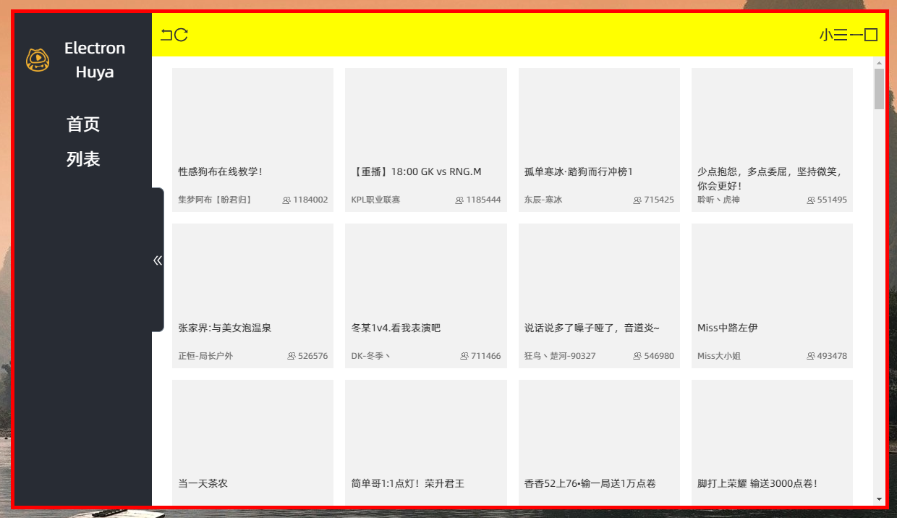
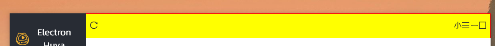

# Electron-Huya

一个使用 Electron + React 实现的虎牙直播客户端

## 脚本

### `npm run dev`

启动开发环境

### `npm run build`

开始构建，build得到的应用会放在release文件夹内

**PS**
> build 文件夹是临时目录，在开发和打包的时候会生成

## 其他

使用chrome://inspect/可以进行调试，但是超级蛋疼。。。

如果想要用`webstorm`调试的话可以使用`webstorm`的连接方式，还能够自动连接


使用了concurrently同时运行多条命令（开发渲染进程和开发主进程）,如果开发环境里控制台提示react-dev启动成功但是窗口并未出现，按 F5 或 ctrl+R 刷新页面，会出现这个情况是因为electron主线程已经启动了但是react-dev还没有启动好，或者随便修改一处主线程中的代码让electron自动重启即可。

在[无边框窗口](https://electronjs.org/docs/api/frameless-window)中的一个小坑：如果对设置了 `-webkit-app-region: drag;` 的元素设置 `visibility: hidden;` ,这个区域还是会被认为是可拖拽的区域，而 `display:none` 是正常效果，因此在自定义标题栏时需要注意避免使用 `visibility` 控制显隐

**关于antd**

antd中有一条,全局设置盒模型的，这个需要注意一下，以免在开发的时候浪费事件在蛋疼为什么尺寸不对上

```css
*, *::before, 
*::after {
  box-sizing: border-box;
}
```

使用了 [create-react-app](https://www.html.cn/create-react-app) 作为基础模版，Tag `boilerplate` 可以作为 Electron + React的开发模版，因为 [electron-react-boilerplate](https://github.com/electron-react-boilerplate/electron-react-boilerplate) 有点太复杂了所以按照 [electron-vue](https://github.com/SimulatedGREG/electron-vue) 自己搭了一个，更多可以查看 [create-react-app](https://www.html.cn/create-react-app) 的文档 ,另外为了修改里面的一些配置，使用了 `react-app-rewired` 这个库，这是在`antd`官网上提到的。

直接使用electron-packager能够设置Windows下的图标，但是不能设置linux下的。。。，如果想要设置启动项的图标需要使用制作安装包的工具，这个在electron-packager的readme里面有提到，另外可以通过BrowserWindow的icon选项手动设置底部任务栏里的图标，但是需要注意路径，为了能够获得正确的路径，在webpack打包主进程的时候设置__dirname和__filename为false，electron在运行时才能获得正确的路径，以便找到打包进去的logo路径,见[issue](https://github.com/electron-userland/electron-packager/issues/935)

使用redux-persist持久化存储，[使用方式参考链接](https://www.jianshu.com/p/8a2b9be974a7)

在列表中使用了less循环计算出在不同宽度下的项目宽度（媒体查询，见 List.module.less）

关于less的作用域的小陷阱：声明函数时就已经确定了作用域范围，与JS中闭包取值相同，

```less
@i: 1px;
.func(){
  width: @i;
}
.a{
  @i :2px;
  .func();
}
```

最终得到的结果是
```css
.a {
  width: 1px;
}
```

**使用 `less + css var()变量` 做换肤功能：**

见 style/theme.less 文件，其实直接使用var() 也可以，但是这样IDE就没有了代码提示，如果不需要考虑兼容性的话直接上CSS var就可以了，反正现在EDGE也已经支持了，[关于兼容性](https://developer.mozilla.org/zh-CN/docs/Web/CSS/var)，如果考虑兼容性做个🔨换肤，这种功能也是锦上添花罢了。(YouTube主页也整站使用了css var，每一行颜色都写了一个css变量和一个默认的颜色，估计是为了兼容)

**使用iconfont上的图标**

见[antd上的说明](https://ant.design/components/icon-cn/#components-icon-demo-iconfont)，在这里对里面的 `Icon.createFromIconfontCN` 生成的组件进行一个包装，以便IDE有代码提示，PS：在开发完成后应当把文件下载下来并手动引入,相关代码在 `components/myIcon/MyIcon`

**react-router刷新页面**

加了一个专用于刷新的路由，不渲染东西，在加载时就刷新到置顶页面去,具体实现是一个混入的方法，以便调用，见 `src/render/util/mixin.js` 和 `src/render/pages/redirect/RedirectPage.jsx`，这样就能在刷新的时候保证 componentDidMount 被调用

或者是直接使用 componentWillReceiveProps

(其实这方法我是从vue-element-admin中抄来的😳，因为找了好久都没找到办法，如果知道的能告诉我不胜感激)

**关于切换时保存路由状态**
这个项目中没有考虑这个，参考[这篇](https://blog.csdn.net/yuzhongzi81/article/details/79089122)，或者考虑使用[react-keeper](https://github.com/vifird/react-keeper)，能够实现类似vue中`<keep-alive>` 的功能

**对于无边框的应用自制最大化按钮时 `currentWindow.isMaximized()` 一直返回false的问题**
这个应该是一个Electron在win10下的bug，见[Electron issue 9092](https://github.com/electron/electron/issues/9092)，如果需要自实现无边框的最大化按钮的话只能自己记录当前的最大化状态了，这里在redux中用一个变量 `isMaximized` 代表是否最大化，根据这个值判断即可决定是调用窗口最大化还是窗口最小化的函数，另外因为redux被持久化存储了，在组件挂载时判断当前 redux 中 `isMaximized` 的值即可恢复上一次关闭时的窗口状态，达到记忆的效果。 

**无边框窗口无法拖动边缘调整窗口大小的问题**
主要是出现在可拖动区域内（比如标题栏），因为设置了拖拽的区域无法接收到鼠标事件自然也就不会有拖拽边缘的事件了

解决方案：
- 在最外层上加一个 `padding:1px` 即可，并使用 `transparent: true` 把背景色设置为透明,下面这个图的红色边框就是本应该是透明的位置,但是会导致最大化时在底部会留有1px可拖动的间距（鬼知道是electron还是Chromium的bug），因此对于需要最大化功能的应用得慎用，见[issue1](https://github.com/electron/electron/issues/8728),[issue2](https://github.com/electron/electron/issues/8350)



- 不设置 `transparent: true` ，还是用给元素加padding的方法，但是这次只加载需要的元素上面，比如我标题栏设置了 `-webkit-app-region: drag;`, 那就在它的外面包装一层并设置 `padding:1px` 和与标题栏相同的背景色，反正也看不出来🙃，把外层换成红色就是下面这样



无边框窗口可拖动区域需要加上drag，中间可操作区域需要no-drag

react-router中非路由组件却需要操作路由的地方需要使用 withRouter 包装

一些异步操作需要在组件卸载时取消掉，避免React报内存泄漏的错误，具体可以在 `componentWillUnmount` 时把this.isMounted这样一个变量设为false来代表已经卸载组件（本来React是有isMounted方法的但是被废弃了，只能自己手动记录）

**感受：**

如果UI没有刚需无边框这东西就别弄了，一堆麻烦事，而且window下的标题栏也不是非常丑，还能方便地设置菜单（说的就是你，deepin linux下超丑的标题栏）

另外，`transparent: true` 慎用，会把窗口自带的阴影丢了而且有bug会导致最大化时底部有可拖动的白色间隙

不用不知道，一用吓一跳，小毛病是真的多，解决方案都得慢慢找。
