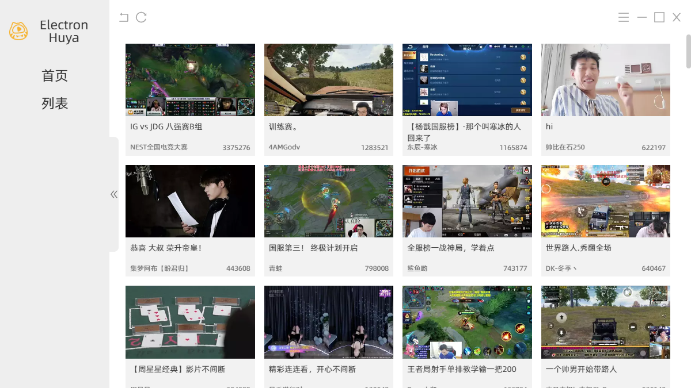
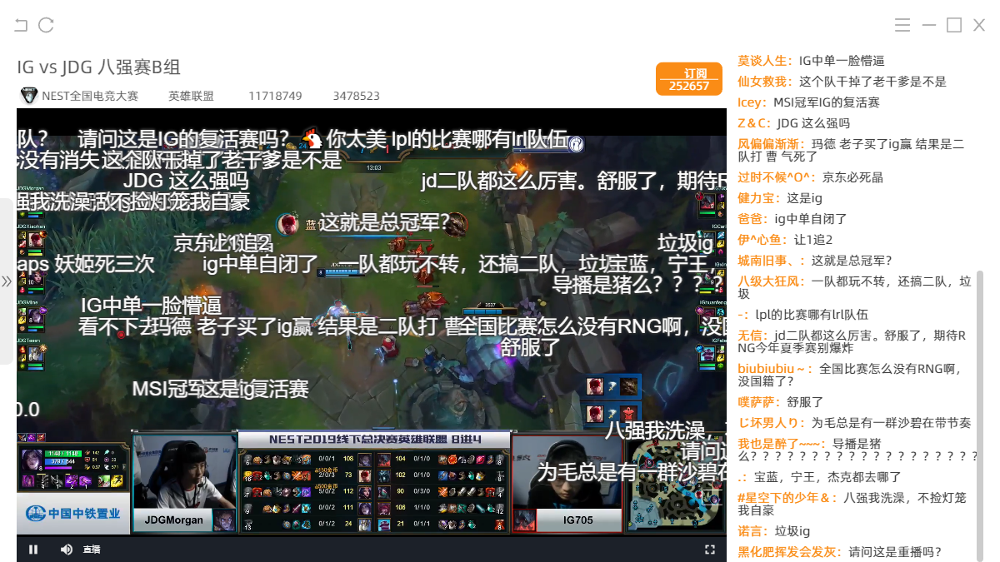

# Electron-Huya

一个使用 Electron + React 实现的虎牙直播客户端

## 简介

之所以选择实现虎牙直播的客户端是因为个人平时喜欢看直播，然而虎牙直播在我的笔记本电脑（linux）浏览器上运行的并不好，电脑风扇呼呼的响显示器还有画面撕裂的现象。

我之前在Window 10下一直使用虎牙的C#客户端，界面很干净，直播秒开还没广告，可惜虎牙的客户端只有Android、IOS和Windows版本的，在linux下都没法安装，于是便想自己做一个，正好也作为一个React和Electron的练手项目。

API由基于Egg的服务端提供，从虎牙获取并处理后以json格式返回数据，在其中扮演中间层的角色，所有数据源头都是虎牙的Web服务。项目地址在[这里](https://github.com/WozHuang/node-huya)

目前只有基本的列表和播放，其他功能还在开发中。。。

**功能列表**

- [x] 窗口最大、最小化、关闭
- [x] 房间列表
- [x] 直播流播放
- [x] 侧边栏弹幕消息列表
- [x] 视频上飘动弹幕

待实现
- [ ] 搜索
- [ ] 直播流格式、码率、线路切换
- [ ] 弹幕设置（速度、透明度、字号、屏蔽）
- [ ] 弹幕优化
- [ ] 分类列表
- [ ] 登录接入（订阅、历史...等与账号相关的功能，待登录接入后确定）
- [ ] 。。。

## 命令

### `npm run dev`

启动开发环境（如果页面空白，使用`F5`或`ctrl+R`刷新页面）

### `npm run build`

开始构建，打包得到的应用会放在release文件夹内，默认只生成当前系统环境的包

**PS**

> build 文件夹是临时目录，在开发和打包的时候会生成
> 
> 后台服务是使用 Egg 写的，地址在[这里](https://github.com/WozHuang/node-huya)，.env文件中默认的服务器地址配置是我的服务器
> 
> [record.md](./record.md)文件中记录在开发过程中遇到的坑和想法

## 说明

本项目纯属学习 React全家桶 + Electron 的玩具，无任何商业用途

## 部分截图

